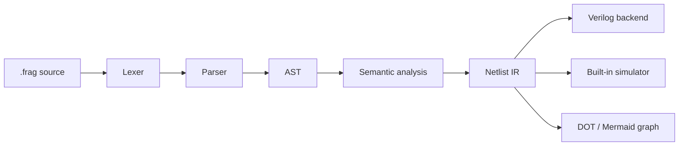
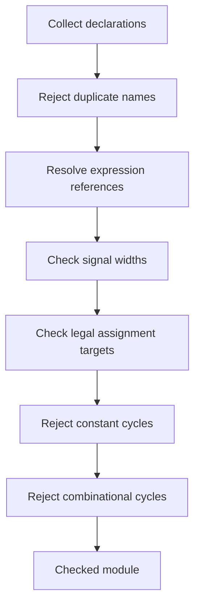
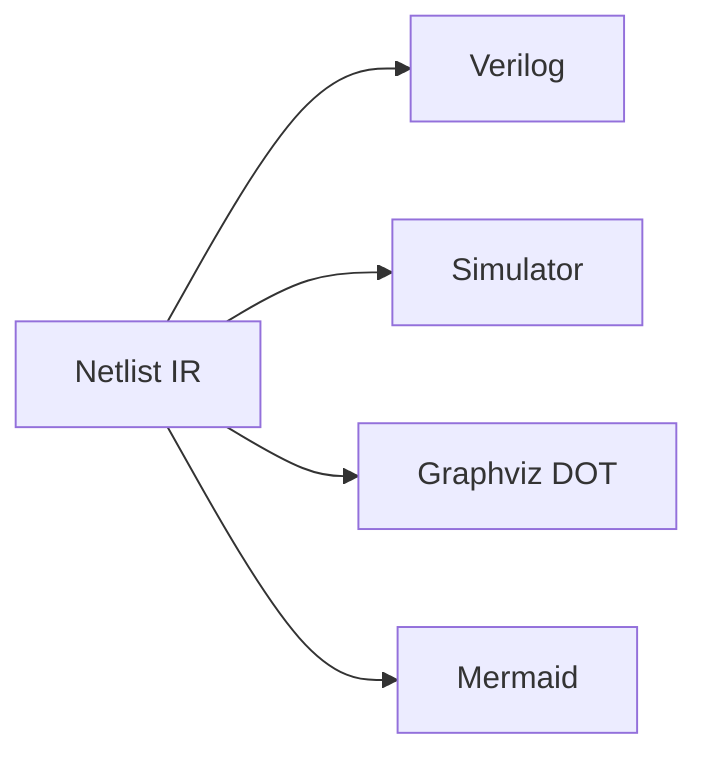

# Frag

Frag is a tiny Hardware Description Language (HDL) compiler written in Rust.

It is built for learning: the codebase is small enough to read, but the compiler still follows a real hardware-toolchain shape:



Frag is not trying to replace Verilog, VHDL, Chisel, or RustHDL. It is a compact educational compiler for understanding how source code becomes hardware structure.

## Status

Frag currently supports a small combinational and sequential HDL:

- Modules
- Inputs, outputs, wires, registers, and constants
- `bit` and `uN` unsigned integer widths up to 128 bits
- Combinational assignments
- Sequential `on rising(clk)` and `on falling(clk)` processes
- Arithmetic, comparison, logical, and bitwise operators
- Semantic checks for unknown signals, duplicate declarations, width mismatches, invalid drivers, unassigned outputs, constant cycles, and combinational cycles
- Verilog generation
- Truth-table and tick-based simulation
- VCD waveform output
- Graphviz DOT and Mermaid graph output

## Quick Start

Build the compiler:

```bash
cargo build
```

Run the HalfAdder example:

```bash
cargo run -- run examples/half_adder.frag
```

Generate Verilog:

```bash
cargo run -- verilog examples/half_adder.frag
```

After installing the binary, replace `cargo run --` with `frag`:

```bash
cargo install --path .
frag ir examples/half_adder.frag
```

## Example Program

```frag
module HalfAdder {
    input a: bit;
    input b: bit;

    output sum: bit;
    output carry: bit;

    sum = a ^ b;
    carry = a & b;
}
```

Generated Verilog:

```verilog
module HalfAdder(
    input a,
    input b,
    output sum,
    output carry
);

assign sum = (a ^ b);
assign carry = (a & b);

endmodule
```

Simulation:

```bash
cargo run -- run examples/half_adder.frag
```

```text
a b | sum carry
0 0 | 0 0
1 0 | 1 0
0 1 | 1 0
1 1 | 0 1
```

## CLI Reference

```text
frag <file.frag>                  Generate Verilog
frag tokens <file.frag>           Print tokens
frag ast <file.frag>              Print AST
frag ir <file.frag>               Print netlist IR
frag verilog <file.frag> [-o out] Generate Verilog
frag run <file.frag> [options]    Simulate a module
frag graph <file.frag> [options]  Emit DOT or Mermaid graph output
```

Simulation options:

```bash
frag run examples/mux2.frag --set a=0,b=1,sel=1
frag run examples/counter.frag --ticks 16 --vcd target/counter.vcd
```

Graph options:

```bash
frag graph examples/half_adder.frag --format mermaid
frag graph examples/half_adder.frag --format dot -o target/half_adder.dot
dot -Tsvg target/half_adder.dot -o target/half_adder.svg
```

## Walkthrough: Source To Hardware

### 1. Tokens

```bash
frag tokens examples/half_adder.frag
```

Frag converts source text into positioned tokens such as:

```text
Module @ 0..6
Identifier(HalfAdder) @ 7..16
LeftBrace @ 17..18
Input @ 23..28
Identifier(a) @ 29..30
```

### 2. AST

```bash
frag ast examples/half_adder.frag
```

The parser builds a syntax tree with declarations and assignments:

```text
Module
  declarations: input a, input b, output sum, output carry
  assignments:
    sum = a ^ b
    carry = a & b
```

### 3. Semantic Analysis

The semantic pass checks that the program means something valid as hardware:



Examples of rejected programs:

```frag
sum = missing ^ b; // Unknown signal `missing`
```

```frag
wire a: bit;
wire a: bit; // Duplicate declaration
```

```frag
y = w;
w = y; // Circular combinational reference
```

### 4. IR

```bash
frag ir examples/half_adder.frag
```

The AST is lowered into a netlist-style IR before any backend runs:

```text
Module HalfAdder
Signals
  input a: bit
  input b: bit
  output sum: bit
  output carry: bit
Combinational
  Gate XOR
    Inputs: a, b
    Output: sum
  Gate AND
    Inputs: a, b
    Output: carry
```

Backends consume the IR, not the source AST:



### 5. Verilog

```bash
frag verilog examples/half_adder.frag -o target/half_adder.v
iverilog -g2012 -tnull target/half_adder.v
verilator --lint-only -Wno-DECLFILENAME target/half_adder.v
```

### 6. Simulation And Waveforms

```bash
frag run examples/counter.frag --ticks 8 --vcd target/counter.vcd
```

```text
Simulation: Counter (8 ticks)
clk: 01010101
count: 01234567
count_reg: 01234567
```

Open the VCD with GTKWave:

```bash
gtkwave target/counter.vcd
```

## Language Notes

The language is intentionally small. A module contains declarations, combinational assignments, and optional clocked processes.

```frag
module Counter {
    input clk: bit;
    output count: u8;

    reg count_reg: u8;

    count = count_reg;

    on rising(clk) {
        count_reg = count_reg + 1;
    }
}
```

Detailed syntax notes live in [docs/LANGUAGE.md](docs/LANGUAGE.md).

## Install External Tools

Frag itself only requires Rust. External tools are optional, but recommended for checking generated Verilog and viewing outputs.

Ubuntu / Debian:

```bash
sudo apt-get update
sudo apt-get install -y iverilog verilator graphviz gtkwave
```

MSYS2 MinGW64:

```bash
pacman -Syu
pacman -S --needed mingw-w64-x86_64-iverilog mingw-w64-x86_64-verilator mingw-w64-x86_64-graphviz mingw-w64-x86_64-gtkwave
```

If your shell cannot launch Verilator's script directly on Windows, call the binary with:

```powershell
$env:VERILATOR_ROOT = "C:\msys64\mingw64\share\verilator"
C:\msys64\mingw64\bin\verilator_bin.exe --version
```

## Verify The Repository

Rust-only checks:

```bash
cargo fmt --check
cargo clippy --all-targets -- -D warnings
cargo test
cargo build --release
```

Full checks with external HDL tools:

```bash
export FRAG_REQUIRE_EXTERNAL_TOOLS=1
cargo test
mkdir -p target/verify
cargo run --release -- verilog examples/half_adder.frag -o target/verify/half_adder.v
iverilog -g2012 -tnull target/verify/half_adder.v
verilator --lint-only -Wno-DECLFILENAME target/verify/half_adder.v
```

Check every example:

```bash
mkdir -p target/verify/verilog
for file in examples/*.frag; do
  name="$(basename "$file" .frag)"
  cargo run --release -- verilog "$file" -o "target/verify/verilog/$name.v"
  iverilog -g2012 -tnull "target/verify/verilog/$name.v"
  verilator --lint-only -Wno-DECLFILENAME "target/verify/verilog/$name.v"
done
```

## Repository Layout

```text
src/
  ast.rs         AST definitions
  diagnostic.rs  Error spans and compiler diagnostics
  lexer.rs       Tokenizer
  parser.rs      Recursive descent parser
  semantic.rs    Semantic analyzer
  ir.rs          Netlist IR
  verilog.rs     Verilog backend
  simulator.rs   Truth table, tick simulation, and VCD
  graph.rs       DOT and Mermaid graph backends
  main.rs        CLI

examples/        Example circuits
tests/           Compiler and external-tool integration tests
docs/            Design and language documentation
```

## Examples

The repository includes more than ten circuits:

- Half adder
- Full adder
- AND gate
- XOR gate
- 2:1 mux
- Majority gate
- 1-bit comparator
- 2-to-4 decoder
- 4-bit incrementer
- 1-bit ALU slice
- Counter
- 8-bit register
- Constant mask demo

## Contributing

Contributions are welcome. Please read [CONTRIBUTING.md](CONTRIBUTING.md) before opening a pull request.

Good first contributions include:

- Better diagnostics
- More examples
- Parser tests
- Verilog backend improvements
- Simulator correctness tests
- Documentation improvements

## License

Frag is licensed under the MIT License. See [LICENSE](LICENSE).
