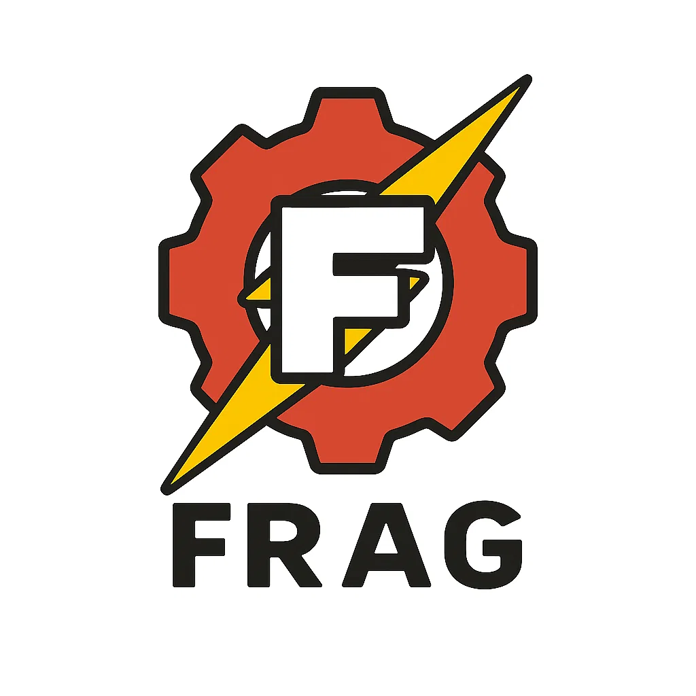
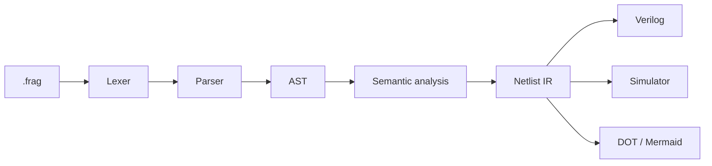

<p align="center">
  
</p>

<h1 align="center">Frag</h1>

<p align="center">
  A small HDL compiler in Rust with Verilog generation, simulation, and graph output.
</p>

<p align="center">
  <a href="https://github.com/afnanksalal/frag/actions/workflows/ci.yml"></a>
  <a href="LICENSE"></a>
  
</p>

Frag is a compact Hardware Description Language compiler. It parses `.frag`
source files, performs semantic checks, lowers the checked module into a
typed netlist-style IR, and emits Verilog, simulator output, or graph output.



## Status

Frag is pre-1.0. The language and CLI may change between alpha releases.

Supported:

- Single-module `.frag` source files
- `input`, `output`, `wire`, `reg`, and `const` declarations
- `bit`, `bool`, and `uN` unsigned integer widths up to 128 bits
- Combinational assignments
- Sequential `on rising(clk)` and `on falling(clk)` processes
- Arithmetic, comparison, logical, bitwise, and shift operators
- Bit indexing and slicing with `value[3]` and `value[7:4]`
- `if condition { a } else { b }` conditional expressions
- `case selector { pattern => value, else => value }` expressions
- Source-span diagnostics
- IR validation after lowering
- Verilog generation
- Truth-table and tick-based simulation
- VCD waveform output
- Graphviz DOT and Mermaid graph output

Semantic checks:

- Duplicate declarations
- Unknown signals
- Invalid assignment targets
- Width mismatches
- Unassigned outputs
- Multiple combinational drivers
- Multiple sequential register drivers
- Invalid clocks
- Constant dependency cycles
- Combinational dependency cycles

Current limits:

- One module per file
- No module instantiation
- No arrays or memories
- No loops or generics
- No signed arithmetic
- No reset syntax

## Install

The repository pins Rust in [rust-toolchain.toml](rust-toolchain.toml).

```bash
cargo build
cargo install --path .
```

External tools are optional but recommended for generated Verilog validation and
waveform inspection.

Ubuntu / Debian:

```bash
sudo apt-get update
sudo apt-get install -y iverilog verilator graphviz gtkwave
```

MSYS2 MinGW64:

```bash
pacman -Syu
pacman -S --needed mingw-w64-x86_64-iverilog mingw-w64-x86_64-verilator mingw-w64-x86_64-graphviz mingw-w64-x86_64-gtkwave
```

## Usage

```text
frag <file.frag>                  Generate Verilog
frag tokens <file.frag>           Print tokens
frag ast <file.frag>              Print AST
frag ir <file.frag>               Print netlist IR
frag check <file.frag>            Validate frontend, semantics, and IR
frag verilog <file.frag> [-o out] Generate Verilog
frag run <file.frag> [options]    Simulate a module
frag graph <file.frag> [options]  Emit DOT or Mermaid graph output
```

Simulation options:

```bash
frag check examples/half_adder.frag
frag run examples/half_adder.frag
frag run examples/mux4_if.frag --set sel=2,a=10,b=20,c=30,d=40
frag run examples/counter.frag --ticks 16 --vcd target/counter.vcd
```

Graph options:

```bash
frag graph examples/half_adder.frag --format mermaid
frag graph examples/half_adder.frag --format dot -o target/half_adder.dot
dot -Tsvg target/half_adder.dot -o target/half_adder.svg
```

Verilog validation:

```bash
frag verilog examples/half_adder.frag -o target/half_adder.v
iverilog -g2012 -tnull target/half_adder.v
verilator --lint-only -Wno-DECLFILENAME target/half_adder.v
```

## Language Example

```frag
module HalfAdder {
    input a: bit;
    input b: bit;

    output sum: bit;
    output carry: bit;

    sum = a ^ b;
    carry = a & b;
}
```

Generated Verilog:

```verilog
module HalfAdder(
    input a,
    input b,
    output sum,
    output carry
);

assign sum = (a ^ b);
assign carry = (a & b);

endmodule
```

Conditional expression:

```frag
module Mux2If {
    input sel: bit;
    input a: u8;
    input b: u8;

    output out: u8;

    out = if sel { a } else { b };
}
```

Generated Verilog:

```verilog
assign out = (sel ? a : b);
```

Case expression:

```frag
out = case sel {
    0 => a,
    1 => b,
    else => c
};
```

Bit selection:

```frag
high = data[7:4];
low = data[3:0];
top = data[7];
masked_low = (data & mask)[3:0];
```

## Verification

Rust-only checks:

```bash
cargo fmt --check
cargo clippy --all-targets -- -D warnings
cargo test
cargo doc --no-deps
cargo build --release
```

External-tool checks:

```bash
export FRAG_REQUIRE_EXTERNAL_TOOLS=1
cargo test
```

Check all example-generated Verilog:

```bash
mkdir -p target/verify/verilog
for file in examples/*.frag; do
  name="$(basename "$file" .frag)"
  cargo run --release -- verilog "$file" -o "target/verify/verilog/$name.v"
  iverilog -g2012 -tnull "target/verify/verilog/$name.v"
  verilator --lint-only -Wno-DECLFILENAME "target/verify/verilog/$name.v"
done
```

## Repository Layout

```text
src/
  ast.rs          AST definitions
  diagnostic.rs   Diagnostics and spans
  graph.rs        DOT and Mermaid graph backends
  ir.rs           Netlist IR
  lexer.rs        Tokenizer
  main.rs         CLI
  parser.rs       Recursive descent parser
  semantic.rs     Semantic analyzer
  simulator.rs    Simulator and VCD output
  verilog.rs      Verilog backend

examples/         Example circuits
tests/            Integration tests
docs/             Architecture, language, roadmap, and release process docs
```

## Examples

The repository includes these circuits:

- 1-bit ALU slice
- 1-bit comparator
- 2:1 mux
- 2-to-4 decoder
- 4:1 conditional mux
- 4:1 case mux
- 4-bit incrementer
- 8-bit register
- AND gate
- Constant mask
- Counter
- Full adder
- Half adder
- Majority gate
- Nibble splitter
- XOR gate

## Documentation

- [Architecture](docs/ARCHITECTURE.md)
- [Language reference](docs/LANGUAGE.md)
- [Grammar](docs/GRAMMAR.md)
- [Roadmap](docs/FUTURE_SCOPE.md)
- [Release process](docs/RELEASE_PROCESS.md)
- [Contributing](CONTRIBUTING.md)
- [Security policy](SECURITY.md)

## Releases

Releases are tag-driven. Pushing a version tag such as `v0.1.0-alpha.N` runs
the release workflow and uploads Linux, macOS, and Windows binaries with
checksum files.

## License

Frag is licensed under the MIT License. See [LICENSE](LICENSE).
