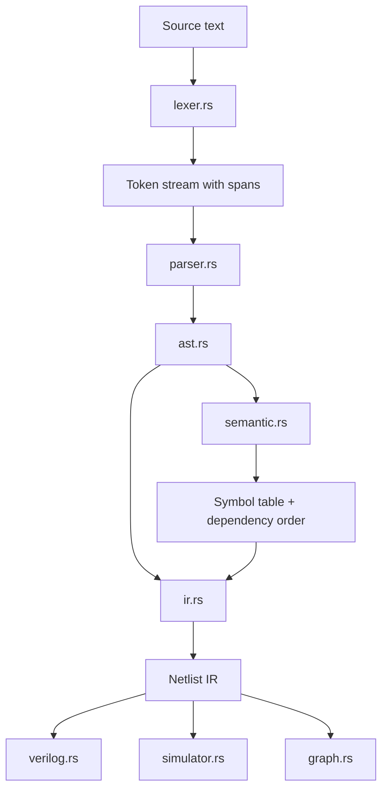
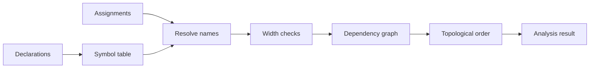

# Architecture

Frag is organized as a conventional compiler pipeline with a hardware-oriented IR.



## Frontend

The frontend is split into three stages.

### Lexer

`src/lexer.rs` converts source text into tokens and records byte spans. The lexer handles whitespace, line comments, block comments, identifiers, number literals, punctuation, and operators.

The lexer does not decide whether a program is valid hardware. It only reports lexical errors such as unexpected characters and unterminated block comments.

### Parser

`src/parser.rs` is a recursive descent parser. It turns tokens into the AST defined in `src/ast.rs`.

Expression parsing is precedence-based. Assignment, declaration, and process parsing are implemented as explicit parser routines.

### AST

`src/ast.rs` represents source-level structure:

- module declarations
- combinational assignments
- sequential processes
- expressions
- operators
- source spans

The AST intentionally stays close to the source language.

## Semantic Analysis

`src/semantic.rs` validates the AST and computes information that backends need.

Checks include:

- duplicate declarations
- unknown signals
- invalid assignment targets
- width mismatches
- unassigned outputs
- multiple combinational drivers
- multiple sequential register drivers
- invalid clocks
- constant dependency cycles
- combinational dependency cycles

The semantic pass also computes topological ordering for constants and combinational assignments. This means later stages can evaluate or emit dependencies before dependents.



## IR

`src/ir.rs` lowers the checked AST into a small netlist-style IR.

The IR is not Verilog. It is the shared representation consumed by all backends.

```text
Module HalfAdder
Signals
  input a: bit
  input b: bit
  output sum: bit
  output carry: bit
Combinational
  Gate XOR
    Inputs: a, b
    Output: sum
  Gate AND
    Inputs: a, b
    Output: carry
```

This separation is important because it keeps future backends possible:

- Verilog
- simulator
- VCD
- visualization
- optimization passes
- other HDL targets

## Backends

### Verilog

`src/verilog.rs` emits synthesizable-style Verilog:

- inputs and outputs become module ports
- constants become `localparam`
- wires and registers become declarations
- combinational assignments become `assign`
- sequential processes become `always @(posedge/negedge clk)` blocks

### Simulator

`src/simulator.rs` evaluates the IR directly.

Combinational modules produce truth tables when total input width is small enough. Sequential modules run for a configurable number of ticks and can emit VCD waveforms.

### Graph

`src/graph.rs` emits:

- Graphviz DOT
- Mermaid flowcharts

These outputs are intended for documentation, inspection, and generated design artifacts.

## CLI

`src/main.rs` is intentionally thin. It handles file IO and command dispatch, then calls the compiler library.

The public library entry point is:

```rust
frag_compiler::compile(source)
```

That function returns the AST, semantic analysis, and IR together for tools that want to inspect the full pipeline.
