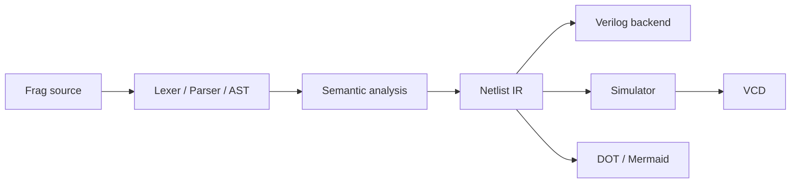

# Roadmap

This document tracks planned development work for Frag. It is not a language
specification; implemented behavior is documented in
[LANGUAGE.md](LANGUAGE.md).

Frag is currently a small HDL compiler with a single-module frontend,
semantic checks, a netlist-style IR, Verilog emission, simulation, VCD output,
and graph generation.

## Design Constraints

- Keep the compiler pipeline explicit: lexer, parser, AST, semantic analysis,
  IR, and backends.
- Do not emit Verilog directly from the AST.
- Keep the source language small until the typed IR and diagnostics are stable.
- Prefer explicit hardware semantics over implicit inference.
- Maintain compatibility with Icarus Verilog and Verilator for generated
  Verilog.
- Add tests for every language feature across parsing, semantic analysis,
  backend output, and simulation where applicable.



## Current Scope

Implemented language and tooling:

- Single module per source file
- Inputs, outputs, wires, registers, and constants
- `bit`, `bool`, and `uN` unsigned widths
- Combinational assignments
- Sequential `on rising(clk)` and `on falling(clk)` processes
- Arithmetic, comparison, logical, bitwise, and shift operators
- Bit indexing and descending inclusive slicing:

```frag
top = data[7];
high = data[7:4];
```

- Conditional expressions:

```frag
out = if sel { a } else { b };
```

- Case expressions:

```frag
out = case sel {
    0 => a,
    1 => b,
    else => c
};
```

- Verilog backend
- Typed expression IR consumed by all backends
- IR validation after lowering
- `frag check`
- Truth-table and tick-based simulator
- VCD waveform output
- Graphviz DOT and Mermaid output
- CI checks with Rust, Icarus Verilog, and Verilator

## Milestone 1: Frontend Stability

Goal: make the current single-module language predictable and well-covered.

Planned work:

- Parser regression tests for every syntax form
- More precise diagnostic spans
- Better diagnostics for missing semicolons, braces, and `else` blocks
- Snapshot tests for AST and diagnostic output
- Broader snapshot coverage across examples and diagnostics

## Milestone 2: Combinational Hardware Features

Goal: support common combinational patterns without leaving the current
single-module model.

Planned work:

- Concatenation
- Explicit zero/sign extension helpers
- Constant folding pass over IR
- Dead wire elimination

Example direction:

```frag
out = case sel {
    0 => a,
    1 => b,
    2 => c,
    else => d
};
```

## Milestone 3: Sequential Hardware Features

Goal: improve register and process modeling while keeping generated Verilog
synthesizable.

Planned work:

- Reset syntax
- Enable conditions
- Register initialization policy
- Finite-state-machine support
- Clock-domain validation for simple designs
- Clearer distinction between combinational and sequential assignment rules

Example direction:

```frag
on rising(clk) reset(rst) {
    if rst {
        count = 0;
    } else {
        count = count + 1;
    }
}
```

## Milestone 4: Module Composition

Goal: compile designs made from multiple modules.

Planned work:

- Multiple modules per file or project
- Module imports
- Named port connections
- Hierarchical IR
- Verilog emission for composed modules
- Dependency ordering across modules

Example direction:

```frag
module Top {
    input a: bit;
    input b: bit;

    output sum: bit;
    output carry: bit;

    HalfAdder ha(.a(a), .b(b), .sum(sum), .carry(carry));
}
```

## Milestone 5: Project Workflow

Goal: support repeatable command-line workflows for larger repositories.

Planned work:

- `frag.toml`
- Project-wide builds
- Project-wide check mode
- Generated output directories
- `frag build`
- `frag sim`
- `frag fmt`
- `frag graph`

Example direction:

```bash
frag check src/top.frag
frag build --target verilog
frag sim examples/counter.frag --ticks 32 --vcd target/counter.vcd
frag graph src/top.frag --format svg
```

## Milestone 6: Simulator And Testbench Support

Goal: improve local validation without requiring an external Verilog simulator
for every check.

Planned work:

- Event-driven simulation model
- Testbench syntax
- Assertions
- Golden-output tests
- Randomized input tests
- VCD and FST output
- CLI support for selecting watched signals

Example direction:

```frag
test HalfAdderTruthTable {
    expect HalfAdder(a=0, b=0).sum == 0;
    expect HalfAdder(a=1, b=0).sum == 1;
    expect HalfAdder(a=0, b=1).sum == 1;
    expect HalfAdder(a=1, b=1).carry == 1;
}
```

## Milestone 7: FPGA Toolchain Integration

Goal: provide optional integration with common open-source FPGA tooling.

Planned work:

- Yosys integration
- nextpnr integration
- Board templates
- Pin constraint handling
- Build reports
- Optional flash commands for supported boards

Example direction:

```bash
frag fpga build --board icebreaker src/top.frag
frag fpga flash --board icebreaker
```

## Non-Goals For The Near Term

- SystemVerilog compatibility as a source language
- Macro systems
- Advanced generics
- Vendor-specific primitives in the core language
- Large standard libraries before module composition is stable
- Timing closure or synthesis optimization beyond basic IR cleanup
