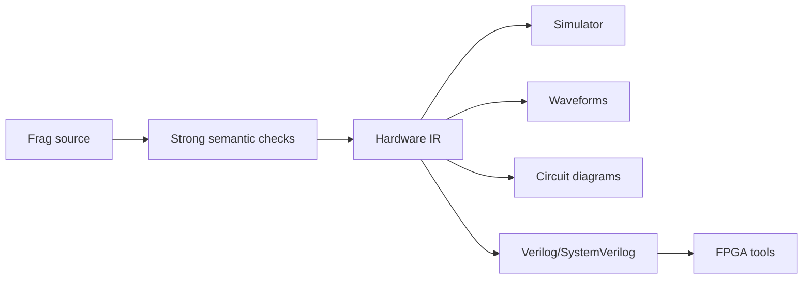

# Future Scope

Frag starts as a tiny HDL compiler, but the long-term vision is bigger: make it a clean, modern, teachable hardware language that can grow from classroom demos into practical FPGA-oriented workflows.

The project should remain readable and educational even as it gains power. Every major feature should help users understand how hardware is represented, checked, simulated, and emitted by real toolchains.

## North Star

Frag should become:

- A beginner-friendly HDL for learning digital design
- A compiler-engineering playground for students and systems developers
- A Verilog-generating frontend that can integrate with existing FPGA tools
- A simulator and visualization environment for small hardware designs
- A well-documented open-source codebase that explains itself



## Guiding Principles

- Keep the compiler pipeline explicit.
- Keep the IR separate from the AST.
- Prefer clear semantics over clever syntax.
- Generate industry-compatible Verilog/SystemVerilog.
- Make errors helpful enough for beginners.
- Keep examples and docs in sync with real compiler behavior.
- Treat visualization and simulation as first-class features.

## Roadmap

### Phase 1: Solid Tiny HDL

Current focus:

- Single-module designs
- Combinational logic
- Basic sequential registers
- Verilog generation
- Truth-table and tick simulation
- DOT, Mermaid, and VCD output
- CI checks with Rust, Icarus Verilog, and Verilator

This phase is about trust. Frag should parse, check, emit, and simulate small designs reliably.

### Phase 2: Better Hardware Syntax

Planned features:

- `if` / `else`
- `case`
- reset syntax
- mux-friendly expressions
- named intermediate wires
- better register initialization semantics

Example direction:

```frag
module Mux4 {
    input sel: u2;
    input a: u8;
    input b: u8;
    input c: u8;
    input d: u8;

    output out: u8;

    case sel {
        0 => out = a;
        1 => out = b;
        2 => out = c;
        3 => out = d;
    }
}
```

### Phase 3: Module Composition

Frag needs module instantiation to move beyond toy examples.

Planned features:

- Multiple modules per file or project
- Module imports
- Named port connections
- Hierarchical IR
- Verilog emission for composed designs

Example direction:

```frag
module RippleAdder4 {
    input a: u4;
    input b: u4;
    input cin: bit;

    output sum: u4;
    output cout: bit;

    FullAdder fa0(.a(a[0]), .b(b[0]), .cin(cin), .sum(sum[0]), .carry(c1));
    FullAdder fa1(.a(a[1]), .b(b[1]), .cin(c1), .sum(sum[1]), .carry(c2));
    FullAdder fa2(.a(a[2]), .b(b[2]), .cin(c2), .sum(sum[2]), .carry(c3));
    FullAdder fa3(.a(a[3]), .b(b[3]), .cin(c3), .sum(sum[3]), .carry(cout));
}
```

### Phase 4: Richer Types And Bit Operations

Planned features:

- bit indexing
- slicing
- concatenation
- signed integers
- arrays
- packed structs
- enums for state machines

Example direction:

```frag
output high: u4;
output low: u4;

high = value[7:4];
low = value[3:0];
```

### Phase 5: Real Sequential Design

Planned features:

- reset blocks
- enable conditions
- finite state machines
- clock-domain checks
- clearer blocking vs nonblocking assignment model

Example direction:

```frag
reg state: State;

on rising(clk) reset(rst) {
    if rst {
        state = Idle;
    } else {
        state = next_state;
    }
}
```

### Phase 6: Project System And Tooling

Planned features:

- `frag.toml`
- project-wide builds
- dependency graph
- generated output directories
- `frag check`
- `frag build`
- `frag test`
- `frag fmt`
- `frag graph`
- `frag sim`

Example:

```bash
frag check
frag build --target verilog
frag sim examples/counter.frag --ticks 32 --vcd target/counter.vcd
frag graph src/top.frag --format svg
```

### Phase 7: Simulator Improvements

Planned features:

- event-driven simulation
- testbench support in Frag
- assertions
- waveform inspection
- VCD and FST output
- golden-output tests
- randomized input tests

Example direction:

```frag
test HalfAdderTruthTable {
    expect HalfAdder(a=0, b=0).sum == 0;
    expect HalfAdder(a=1, b=0).sum == 1;
    expect HalfAdder(a=0, b=1).sum == 1;
    expect HalfAdder(a=1, b=1).carry == 1;
}
```

### Phase 8: Optimization Passes

Planned features:

- constant folding
- dead wire elimination
- common subexpression elimination
- width narrowing
- simple gate-level optimization
- IR validation after each pass

The goal is not to out-optimize synthesis tools. The goal is to teach how optimization passes work and to emit cleaner intermediate designs.

### Phase 9: FPGA Workflow

Planned integrations:

- Yosys
- nextpnr
- openFPGA flows where possible
- board templates
- pin constraints
- build reports

Example direction:

```bash
frag fpga build --board icebreaker src/blinky.frag
frag fpga flash --board icebreaker
```

## What Frag Should Not Become Too Quickly

Frag should avoid becoming too complex too early.

Avoid rushing into:

- full SystemVerilog compatibility
- advanced type inference
- macro systems
- complex generics
- vendor-specific primitives as core language features
- large standard libraries before the core HDL is stable

The project should grow in layers. Each layer should be understandable, testable, and documented.

## Long-Term Dream

The dream version of Frag is a small but capable HDL where a beginner can:

1. Write a circuit.
2. See the tokens and AST.
3. Understand the semantic checks.
4. Inspect the IR.
5. Simulate the design.
6. View waveforms.
7. Generate circuit diagrams.
8. Emit Verilog.
9. Run open-source FPGA tools.
10. Put the design on real hardware.

Frag should make the hardware toolchain feel less like magic.

That is the real mission.
